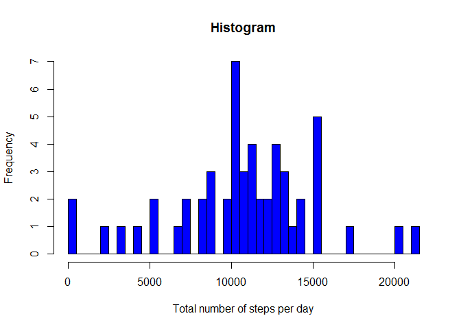
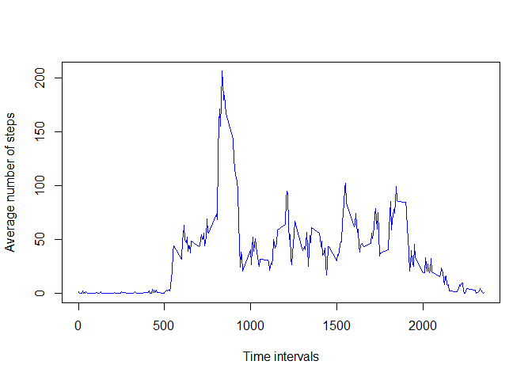
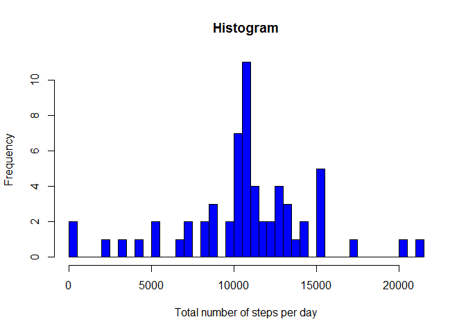
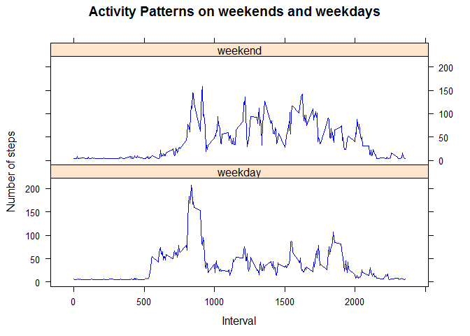

Author: Sainath Kovelamudi


## Loading and preprocessing the data

* Loading the data

```r
activity <- read.csv("activity.csv")
summary(activity)
```

```
##      steps                date          interval     
##  Min.   :  0.00   2012-10-01:  288   Min.   :   0.0  
##  1st Qu.:  0.00   2012-10-02:  288   1st Qu.: 588.8  
##  Median :  0.00   2012-10-03:  288   Median :1177.5  
##  Mean   : 37.38   2012-10-04:  288   Mean   :1177.5  
##  3rd Qu.: 12.00   2012-10-05:  288   3rd Qu.:1766.2  
##  Max.   :806.00   2012-10-06:  288   Max.   :2355.0  
##  NA's   :2304     (Other)   :15840
```

* Processing the data

```r
activity$date <- as.Date(activity$date,"%Y-%m-%d")
```


## What is mean total number of steps taken per day?
* calculating the total number of steps taken per day

```r
totalSteps <- aggregate(steps~date,data=activity,sum,na.rm=TRUE)
head(totalSteps)
```

```
##         date steps
## 1 2012-10-02   126
## 2 2012-10-03 11352
## 3 2012-10-04 12116
## 4 2012-10-05 13294
## 5 2012-10-06 15420
## 6 2012-10-07 11015
```

* histogram for total number of steps taken per day

```r
hist(totalSteps$steps,
     breaks=nrow(totalSteps),col="blue",
     xlab="Total number of steps per day",
     ylab="Frequency",
     main="Histogram")
```

<!-- -->

*The MEAN of the total number of steps taken per day : 1.0766189\times 10^{4}.
*The MEDIAN of the total number of steps taken per day : 10765.

## What is the average daily activity pattern?
*Average number of steps taken in a time interval

```r
avgSteps <- aggregate(steps~interval,data=activity,mean,na.rm=TRUE)
plot(steps~interval,data=avgSteps,type="l",
      xlab="Time intervals",
      ylab="Average number of steps",
      col="blue")
```

<!-- -->
*The maximum number of steps are taken in the interval: 835.

## Imputing missing values
* To see total number of missing values in the dataset

```r
summary(is.na(activity))
```

```
##    steps            date          interval      
##  Mode :logical   Mode :logical   Mode :logical  
##  FALSE:15264     FALSE:17568     FALSE:17568    
##  TRUE :2304
```
*imputing the missing steps value with the mean of the number of steps value and creating a new dataset with the missing values filled


```r
meanSteps<-mean(activity[!is.na(activity$steps),]$steps)
activity1<-activity
activity1[is.na(activity1$steps),]$steps <- meanSteps
```

```r
totalSteps <- aggregate(steps~date,data=activity1,sum)
```
* Histogram of total number of steps taken each day

```r
hist(totalSteps$steps,breaks=nrow(totalSteps),col="blue",
     xlab="Total number of steps per day",
     ylab="Frequency",
     main="Histogram") 
```

<!-- -->
*The MEAN of the total number of steps taken per day : 1.0766189\times 10^{4}.
*The MEDIAN of the total number of steps taken per day : 1.0766189\times 10^{4}.

## Are there differences in activity patterns between weekdays and weekends?
* creating a new factor variable with two levels 'weekday' and 'weekend'

```r
day <- weekdays(activity1$date)
activity1$day <- ifelse(day == "Saturday"| day=="Sunday","weekend","weekday")
head(activity1)
```

```
##     steps       date interval     day
## 1 37.3826 2012-10-01        0 weekday
## 2 37.3826 2012-10-01        5 weekday
## 3 37.3826 2012-10-01       10 weekday
## 4 37.3826 2012-10-01       15 weekday
## 5 37.3826 2012-10-01       20 weekday
## 6 37.3826 2012-10-01       25 weekday
```

* Making a panel plot of average number of steps taken in a interval, averaged across all weekdays or weekdays.


```r
avgSteps1 <- aggregate(activity1$steps,
                      by=list(activity1$interval,activity1$day),mean)
names(avgSteps1) <- c("interval","day","steps")
library(lattice)
xyplot(steps~interval | day, data=avgSteps1, type="l",layout=c(1,2),
       xlab="Interval",ylab="Number of steps",
       main="Activity Patterns on weekends and weekdays",col="blue")
```

<!-- -->
* The activity pattern for weekday has a big spike (peak value = 200) at around the interval value 800 which is not the same in the weekend pattern. The weekend pattern has more number of steps for most other intervals.
